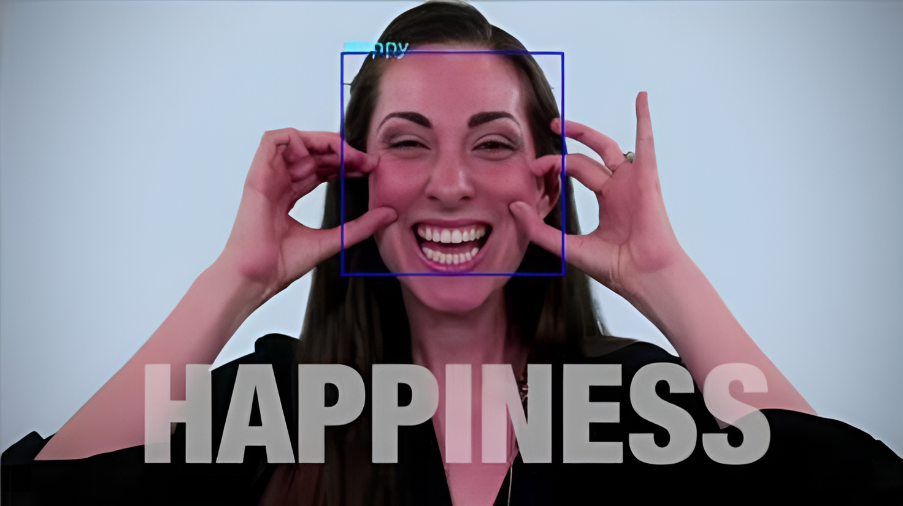
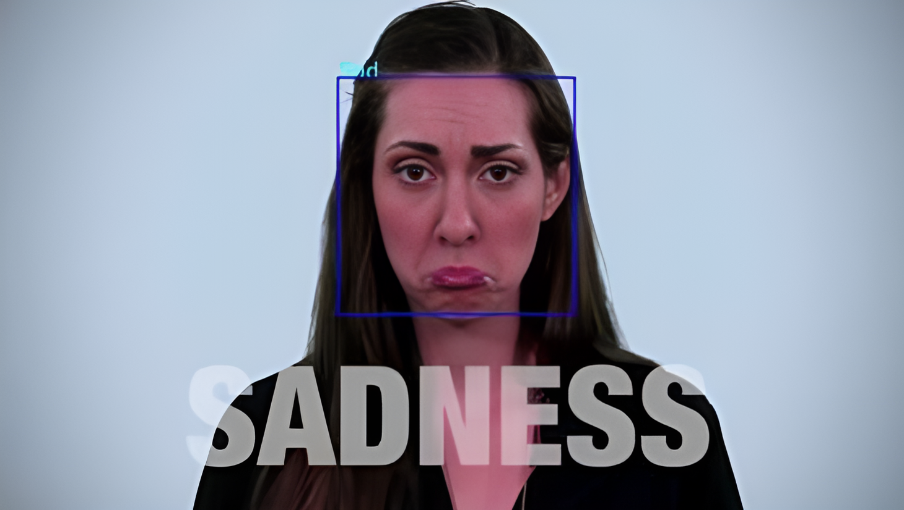
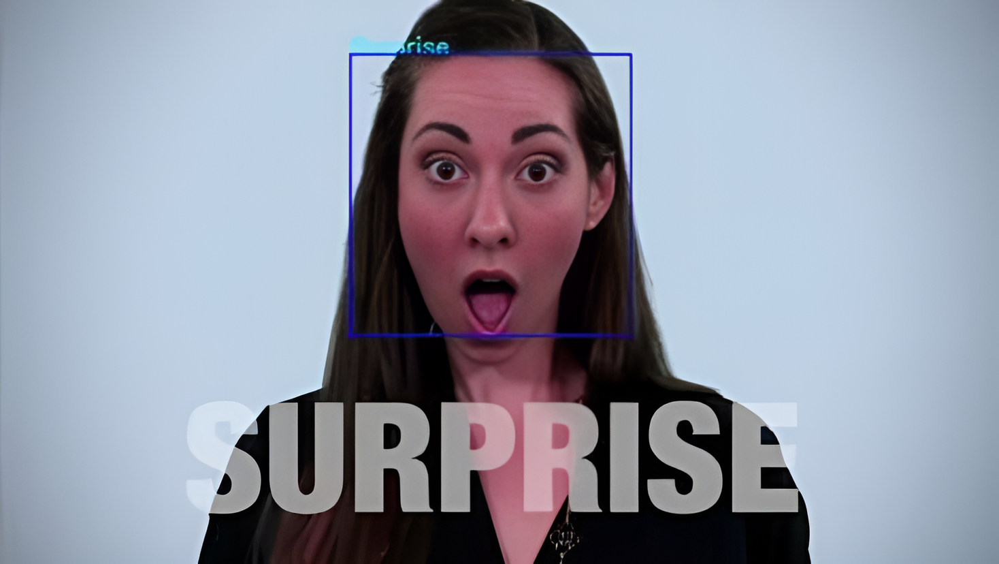
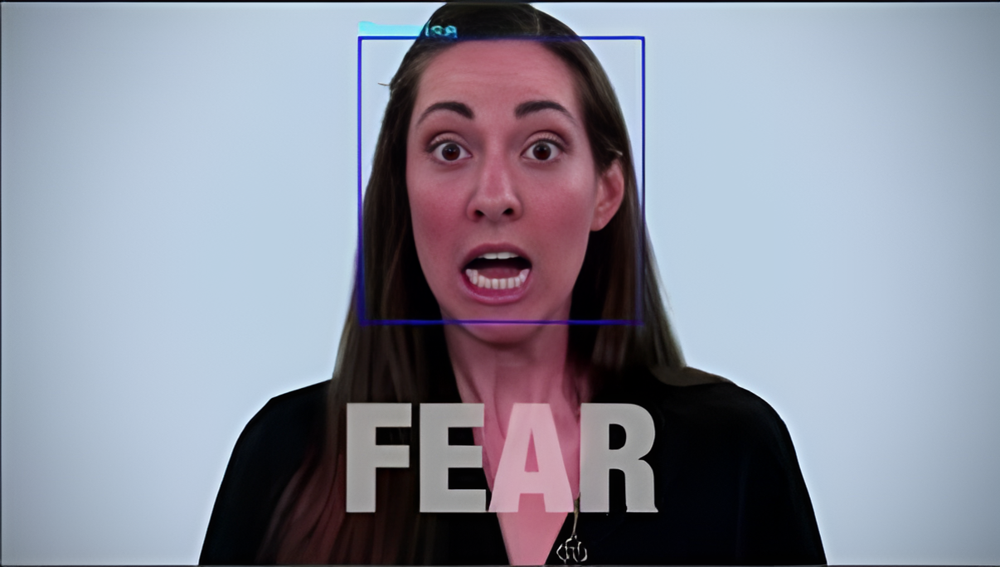
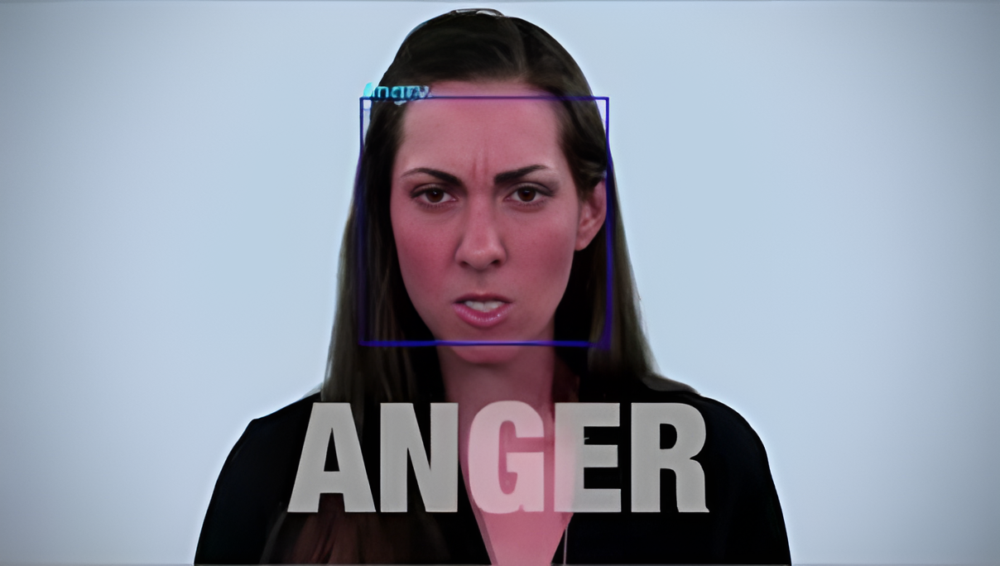

# Face Emotion Recognition  

## Project Overview  
This project focuses on **real-time facial emotion recognition** using deep learning techniques. It employs a **Convolutional Neural Network (CNN)** trained on the **FER2013 dataset** to classify facial expressions into seven categories: **Angry, Disgust, Fear, Happy, Sad, Surprise, and Neutral**. The system is integrated with **OpenCV** for real-time emotion detection from images or live video streams.  

The goal of this project is to create an **accurate, efficient, and scalable emotion detection system** that can be used in various applications such as **human-computer interaction, mental health monitoring, marketing, and entertainment**.  

---

## Features  
- **Real-time emotion detection** from webcam or image input.  
- **Deep learning-based classification** using a **CNN model** trained on FER2013.  
- **Face detection** using OpenCV’s Haar cascade classifiers.  
- **Data preprocessing and augmentation** to improve model performance.  
- **Logging mechanism** that records detected emotions with timestamps.  
- **Graphical visualization** of detected emotions.  

---

## Technologies Used  
- **Python**: The primary programming language for implementation.  
- **TensorFlow/Keras**: Deep learning framework used to train and implement the CNN model.  
- **OpenCV**: Used for real-time video processing and face detection.  
- **FER2013 Dataset**: 48x48 grayscale images labeled with emotions.  
- **Convolutional Neural Networks (CNNs)**: Used for feature extraction and classification.  

---

## Dataset & Preprocessing  
- The **FER2013 dataset** consists of **48x48 grayscale images**, each labeled with one of seven emotions.  
- The dataset undergoes **preprocessing** before feeding into the CNN model:  
  - **Conversion from CSV to PNG format**  
  - **Normalization** of pixel values to a range of [0,1]  
  - **Reshaping** images for CNN compatibility  
  - **Augmentation techniques** like flipping and rotation  

---

## How It Works  
### **1. Face Detection**  
- The system uses **OpenCV Haar Cascade classifiers** to detect faces in each frame.  
- Detected faces are extracted and passed to the CNN model for classification.  

### **2. Emotion Recognition**  
- The extracted face is resized and normalized.  
- The **trained CNN model** classifies the face into one of the seven emotions.  

### **3. Video Processing**  
- The system processes **each frame of a video stream** in real-time.  
- Bounding boxes and emotion labels are displayed on detected faces.   

---

## Results  
The trained model demonstrates **high accuracy** in emotion classification. Below are sample outputs showcasing emotion detection in real-time:  

### **Sample Outputs**  

|  |  |  |
|:-------------------------------------------:|:-------------------------------------------:|:-------------------------------------------:|
| **Detected: Happy** | **Detected: Sad** | **Detected: Surprise** |

|  |  |  |
|:-------------------------------------------:|:-------------------------------------------:|:-------------------------------------------:|
| **Detected: Fear** | **Detected: Anger** | **Detected: Disgust** |

The results illustrate the successful detection of facial emotions in real-time, highlighting the model’s effectiveness in identifying various expressions.  

---

## Future Enhancements  
- **Enhancing Model Accuracy**: Further training with larger, diverse datasets.  
- **Multimodal Emotion Recognition**: Integrating voice and physiological signals.  
- **Robust Real-World Adaptations**: Improving performance under different lighting and angles.  
- **Deployment as a Web or Mobile Application**: Creating an interactive app for practical use.  
- **AI Assistant Integration**: Embedding emotion recognition into virtual assistants.  

---

## Installation 
1. **Clone the repository:**  
   ```sh
   git clone https://github.com/your-username/Face-Emotion-Recognition.git
   cd Face-Emotion-Recognition

2. **Install dependencies:**
   ```sh
   pip install -r requirements.txt

3. **Run the model:**
   ```sh
   python main.py

---